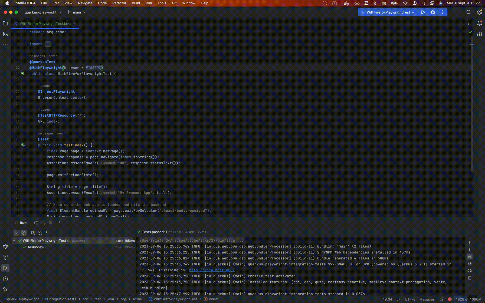

# Quarkus Playwright

[](https://search.maven.org/artifact/io.quarkiverse.playwright/quarkus-playwright)

Easily create effective cross-browsers e2e tests for your Quarkus web-app using Playwright (Qute, Quinoa, Renarde, Web-Bundler, ...):

````java
@QuarkusTest
@WithPlaywright
public class WithDefaultPlaywrightTest {

    @InjectPlaywright
    BrowserContext context;

    @TestHTTPResource("/")
    URL index;

    @Test
    public void testIndex() {
        final Page page = context.newPage();
        Response response = page.navigate(index.toString());
        Assertions.assertEquals("OK", response.statusText());

        page.waitForLoadState();

        String title = page.title();
        Assertions.assertEquals("My Awesome App", title);

        // Make sure the web app is loaded and hits the backend
        final ElementHandle quinoaEl = page.waitForSelector(".toast-body.received");
        String greeting = quinoaEl.innerText();
        Assertions.assertEquals("Hello from RESTEasy Reactive", greeting);
    }
}
````

Debug your tests with the Playwright inspector `@WithPlaywright(debug=true)`:


All the information you need to use Quarkus Playwright is in the [user documentation](https://docs.quarkiverse.io/quarkus-playwright/dev/).


